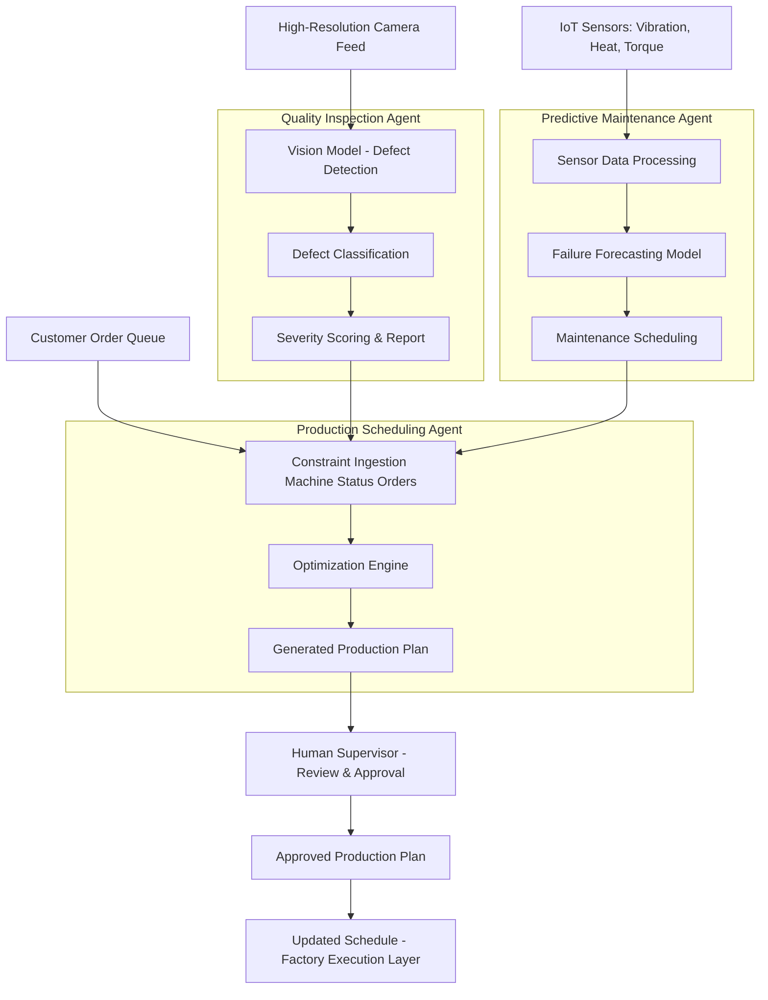

# AI Agents Assignment

## Section 1 — Short Answer Questions

### 1. Compare and contrast LangChain and AutoGen frameworks.  
LangChain and AutoGen both support the development of AI agents, but they differ significantly in architecture and intended use. LangChain focuses on building applications through modular components such as LLM chains, memory, tools, and retrieval systems. It excels in orchestrating deterministic pipelines (e.g., RAG systems, tool-augmented chatbots) and offers flexible integration with vector stores, prompt templates, and model back-ends. Its strengths include granular control and a mature ecosystem, though complex multi-agent interactions can require considerable custom code.

AutoGen, by contrast, is optimized for multi-agent collaboration. It uses conversational protocols between agents (e.g., assistant–assistant, assistant–user, or specialized tool agents) to accomplish tasks through emergent cooperation. AutoGen simplifies agent-to-agent communication and is ideal for tasks requiring iterative reasoning, debate, or role-specialization. However, it can be less transparent, harder to debug, and more computationally expensive due to multi-turn interactions.

In summary:

LangChain → best for structured pipelines

AutoGen → best for autonomous, multi-agent problem solving
Both have limitations: LangChain may require heavy engineering for autonomy, while AutoGen can introduce unpredictability and higher compute overhead.

### 2. How AI Agents are transforming supply chain management.  
AI agents are reshaping supply chain management by enabling real-time decision-making, predictive optimization, and automated cross-system coordination. Intelligent forecasting agents analyze historical data, weather patterns, and market signals to predict demand with greater accuracy, reducing excess inventory and stockouts. Routing and logistics agents dynamically adjust transportation plans based on traffic, fuel costs, and disruptions, minimizing delays and operational expenses.

Production planning agents optimize factory schedules by allocating resources and sequencing manufacturing runs based on constraints such as machine availability, labor capacity, and urgent orders. Autonomous procurement agents negotiate with suppliers, monitor price fluctuations, and trigger purchase orders when thresholds are met. Additionally, warehouse-management agents enable robotic picking, anomaly detection, and inventory cycle counts with minimal human oversight.

Collectively, these systems create a more responsive, resilient, and predictive supply chain. Businesses benefit from lower operating costs, faster delivery times, greater customization capability, and improved service levels. The shift from reactive to proactive supply chain operations represents one of the most meaningful transformations driven by AI agents.

### 3. Human-Agent Symbiosis and its significance.  
Human-Agent Symbiosis describes a collaborative relationship in which humans and autonomous AI agents work together, each complementing the other’s strengths. Instead of replacing human roles, agents amplify human capability by handling cognitive load, routine decision-making, and data-heavy tasks, while humans focus on creativity, oversight, and nuanced judgment. The result is a partnership rather than a substitution.

This is fundamentally different from traditional automation, which aims to eliminate human involvement in predefined, rule-based activities. Automation assumes static workflows; symbiosis assumes dynamic collaboration where agents adapt to human preferences, intentions, and context. As workplaces grow more complex, symbiosis becomes essential, enabling workers to manage larger systems, explore more solutions, and engage in higher-value work.

Its significance for the future of work includes increased productivity, safer working conditions, accelerated innovation, and the creation of new hybrid job roles. Instead of mass displacement, symbiotic systems encourage augmentation, enabling organizations to scale expertise and reduce burnout while still keeping humans in the loop.

### 4. Ethical implications of autonomous AI Agents in financial decision-making.  
Autonomous AI agents used in financial environments carry serious ethical considerations due to their influence on lending, investments, credit scoring, and fraud detection. Unchecked autonomy can lead to biased decisions if training data embeds socioeconomic disparities, resulting in discriminatory loan approvals or unfair risk assessments. Their opacity also makes it difficult for customers to challenge outcomes, raising issues of transparency and accountability.

Additionally, autonomous agents executing high-speed trading or portfolio rebalancing could amplify market volatility if models react to noise or adversarial signals. There is also risk of over-automation, where human supervisors defer excessively to algorithmic recommendations (automation bias).

Safeguards must include:

Explainability requirements for all financial agent decisions

Bias audits and routine fairness testing

Human-in-the-loop governance for high-risk or high-impact actions

Regulated override mechanisms and audit trails

Robust cybersecurity, given the stakes of financial manipulation

These protections ensure that autonomy does not compromise equity, stability, or consumer trust.

### 5. Technical challenges of memory and state management in AI Agents.  
Memory and state management are central to making AI agents effective in real-world applications. Agents must retain context over time, integrate new observations, and update plans dynamically—all while avoiding hallucinations or outdated assumptions. Maintaining this continuity requires mechanisms such as vector-based semantic memory, short-term conversational buffers, and long-term episodic storage.

Challenges arise when memory grows large, becomes inconsistent, or needs continual synchronization across multiple agents and tools. Drift occurs when agents rely on stale or irrelevant information, while excessive memory retrieval can increase latency. Multi-agent systems must coordinate shared state across environments, which introduces concurrency and conflict-resolution issues.

Without robust memory management, agents cannot perform tasks that require multi-step reasoning, planning, personalization, or situational awareness. Effective approaches include memory pruning, time-weighted embeddings, causal logging, and architecture patterns like centralized state stores. These practices ensure reliability, stability, and safe decision-making in operational AI systems.


## Section 2 — Case Study: Smart Manufacturing at AutoParts Inc.

### AI Agent Implementation Strategy  
Proposed AI Agent Implementation Strategy
1. Quality Inspection Agent (Vision + Anomaly Detection)

Utilizes high-resolution cameras and vision transformers to detect micro-defects in precision components.

Automatically flags anomalies, assigns severity scores, and sends cases to human reviewers when confidence is low.

Expected impact: reduce defect rate from 15% → 5% within 6 months.

2. Predictive Maintenance Agent (IoT Sensor + Forecasting Model)

Continuously collects vibration, heat, torque, and cycle-time data.

Predicts failures 24–72 hours in advance and schedules downtime during low-impact windows.

Expected impact: 30–40% reduction in unplanned downtime.

3. Production Scheduling & Optimization Agent

Balances human labor availability, machine utilization, and order urgency.

Automatically adapts schedules when a machine is down or a custom order enters the queue.

Expected impact: 10–15% throughput improvement + faster customization.

4. (Optional) Workforce Augmentation Agent

Provides step-by-step guidance for new workers, AR-assisted setup instructions, and on-demand troubleshooting.

Expected impact: lower training cost, improved retention.

High-Level Workflow Diagram (replace with your exported PNG)

```
┌─────────────────────────────┐       ┌─────────────────────────────────┐
│     Quality Inspection       │       │    Predictive Maintenance      │
│     Agent                    │       │    Agent                        │
│                             │       │                                 │
│  • Detects Defects          │──────▶│  • Schedules Downtime           │
│  • Flags Anomalies          │       │  • Optimizes Maintenance        │
└─────────────────────────────┘       └─────────────────────────────────┘
           │                                           │
           │                                           │
           ▼                                           ▼
┌─────────────────────────────┐       ┌─────────────────────────────────┐
│   Production Scheduling      │◀──────│   Machine Status Update         │
│   & Optimization Agent       │       │   (Real-time Feedback)          │
│                             │       └─────────────────────────────────┘
│  • Adjusts Schedules        │
│  • Balances Resources       │
│  • Optimizes Throughput     │
└─────────────────────────────┘
```


(Replace with your high-resolution workflow from n8n or Make.)


## Enhanced Workflow Diagram (Mermaid)




## ROI & Timeline  
ROI & Timeline
Expected Quantitative ROI

Defect reduction (15% → 5%): annual savings $600k–$1.2M

Downtime reduction (30%): $400k in machine recovery and lost productivity

Throughput increase (10–15%): additional $1M+ revenue capacity

Labor efficiency: $150k–$300k from reduced training and rework

ROI realized within 12–18 months.

Timeline

0–2 months: Data ingestion, sensor setup, pilot workflow

2–5 months: Deploy agents (quality + maintenance) to one production line

5–9 months: Expand to all lines; integrate scheduling agent

9–12 months: Full rollout, optimization, workforce adoption


## Risks & Mitigation  
Risks & Mitigation
Technical

Risk: Sensor noise, inaccurate forecasts
Mitigation: Calibration cycles, continuous retraining

Risk: Integration with legacy machines
Mitigation: API wrappers and edge gateways

Organizational

Risk: Worker resistance
Mitigation: Training, transparent communication

Risk: Skill gap
Mitigation: On-site AI literacy workshops

Ethical

Risk: Perceived surveillance
Mitigation: Limit data collection to machine performance, not individuals

Risk: Job displacement
Mitigation: Use agents for augmentation, not replacement

